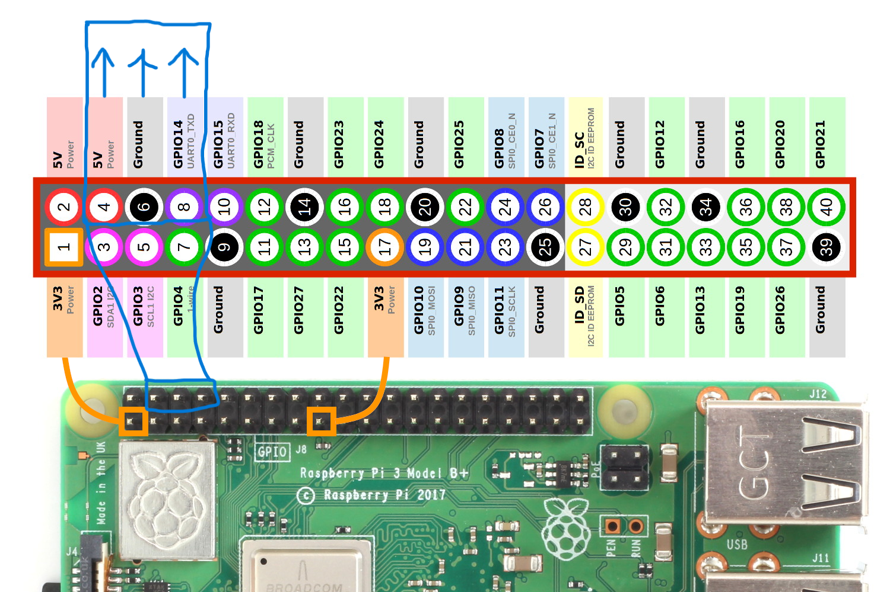

# Couch Bot Using Raspberry Pi 
The newest iteration (2022-2023)

## Start-up Instructions 
(DM Faith or Jake (Demobots) on Discord for help if needed)

1. Double check the batteries are charged and the chrager is unplugged

2. Double check the jumper connections from the Pi to the daughterboard. Make sure that the Logitech USB controller is plugged into the top right USB port.


   The `5V`, `GND`, and `TX0` pins are jumped to the daughterboard in this same sequence from left to right, starting on the red 5V line on the daughterboard. 




3. Flip the main power to on, and make sure the Pi boots up. 

4. Connect to the Pi's wireless access point

	|SSID| Password |
	|--|--|
	|CouchBot  | drowssap  |

5. Using the terminal or PUTTY, SSH into the Pi

	|Hostname| Password |
	|--|--|
	|pi@raspberrypi.local  | raspberry  |
	```
	$ ssh pi@raspberrypi.local
	>raspberry
	```
    (Type `Yes` if prompted.)

6. Run usb initialization command, you'll be prompted for the password `raspberry` again:
	```
	$ sudo chmod 666 /dev/ttyS0 
	```
7. Open a new tmux session and start the program, this will allow the CouchBot program to continue to run even if you terminate the ssh session (avoids having to have a laptop open).

   Run commands:
	
	```
	$ sudo tmux 
	```
	*In tmux session:*

	```
	& sudo python3 /home/CouchPy2/main.py
	```


    Once in the tmux terminal you can 'detach" (exit while leaving session running) with keystroke `CTRL-B` then `D`

	to reattach to the tmux session at anytime in an ssh session run command:
	```
	$ sudo tmux attach
	```


8. Open the E-stop button, verify all motors spin by using the controller, and power off everything.

9. While still on the castors, move CouchBot to the desired demo location, being careful not to damage it or anyone around (it can get heavy on slopes) 

10. When at demo location, while on **FLAT** ground, use the lever-bar to raise the castors, making sure to move the "footrest" bar accordingly. Make sure the castors are not scraping the ground afterwards.

11. ***Repeat steps **3 through 7*****

12. Drive around! 

13. When done driving, power off, use the lever bar to lower the castors, return CouchBot to the RAS office, and plug-in the battery charger.
#


## Couch Drivng Notes:

- CouchBot is only to be taken out when a supervising Demobots leader (Faith, Jake, Anthony etc.) or a RAS Officer is present. Violation of this may result in a termination of your RAS membership.

- ***SAFETY IS OUR #1 PRIORITY***, we don't want to get our Speedway privlegdes revoked! Use the E-stop when needed, and keep out of the way of other vehicles and people not paying attention. Be aware of your surroundings, don't block traffic too much. 
- The batteries last about 1 hour when fully charged, don't keep CouchBot powered on any longer. 
- As of writing, Couchbot veers slightly to the right when driving, be sure to adjust. 
- Make sure all team members  get a chance for a turn driving
- And *If supervising leader approves*, feel free to give demo rides to guests.


#
</br>


## Raspberry Pi Setup Instructions:
1. Create a RPi 32 bit image within an micro SD card
	* set the username and password using the RPi Imager application
2. Paste the file `ssh` and `wpa_supplicant.conf` into the boot folder
	* edit `wpa_supplicant.conf`
3. Add `enable_uart=1` to `config.txt`
4. ssh into the RPi
5. Run commands:
```
$ sudo apt update
$ sudo apt upgrade
$ sudo apt install python3-pip
``` 
6. Clone the github respository into the RPi
7. Install dependencies:
```
$ pip3 install -r ~/couch_bot/requirements.txt
```
8. Change the requirements for the Logitech Controller port:
```
$ sudo chmod 666 /dev/ttyS0
```
9. Run the script:
```
$ python3 ~/couch_bot/couch_bot.py
```

Todo:
1. Documentation
1. Have couch_bot.py start on boot
1. Fix the frame
1. Make the joystick functions in classes/couch_bot.py generic instead of using the Logitech controller values to compute math
1. Avoid running into walls
1. Add code for neopixels

